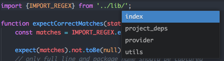

# autocomplete-js-import
Autocomplete+ provider for JS import statements

This allows the completion of any files relative to the current directory.
Additionally, there are settings to enable autocompletion of dependent packages found in the current
project's root package.json file.

# TODO
- [ ] require syntax
- [ ] autocomplete node builtins
- [ ] update project deps when a new folder is opened (currently only loaded on atom start)
